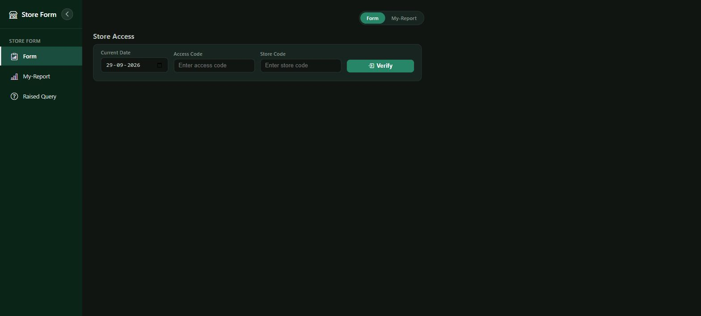
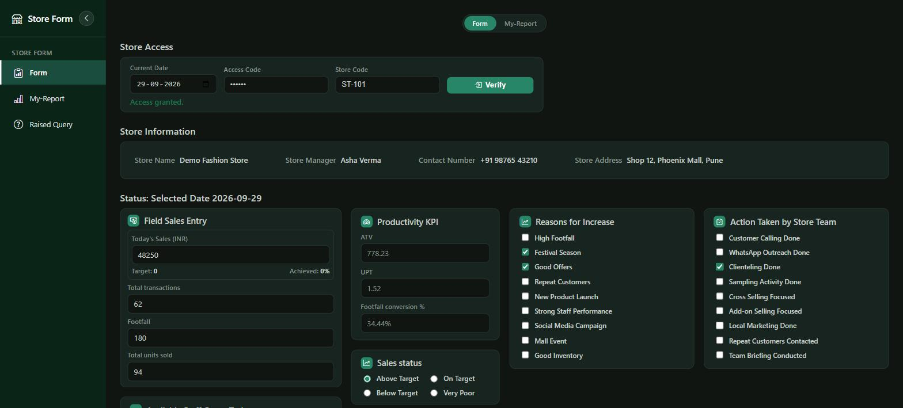
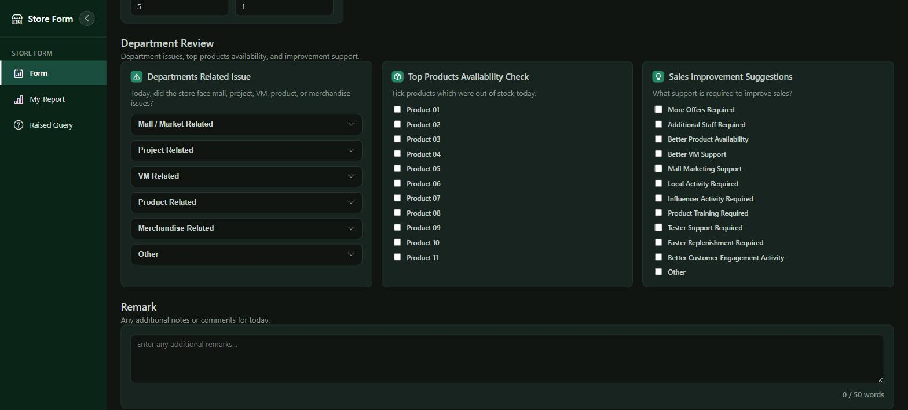

# Daily Sales Reports Collect (DSR)

A store-level Daily Sales Report (DSR) system. Store staff verify access with a
site code and access code, then submit a daily report covering sales,
staffing, targets, department issues, out-of-stock products, and remarks.
Submitted data can be reviewed on a reporting dashboard with KPIs, charts, and
a submission calendar.

## Screenshots

### Form page — before verification



### Form page — after verification

Once the access code and store code are verified, the store's info and the
full DSR entry workspace (sales KPIs, staff counts, sales/store status,
reasons, and actions) become available.



### Form page — department review & remark



> Note: the data shown in these screenshots (store name, manager, sales
> figures, etc.) is sample/demo data used for illustration only.

## Tech stack

- **Backend:** Java 17, Spring Boot 3.3 (Web, Data JPA, Validation)
- **Database:** MySQL
- **Frontend:** Static HTML/CSS/JS served from Spring Boot (`backend/src/main/resources/static`), Bootstrap Icons, Chart.js

## Project structure

```
backend/
  src/main/java/com/dsr/backend/
    controller/   # REST controllers (site access, DSR form)
    dto/          # Request payloads
    entity/       # JPA entities (SiteMaster, DsrFormLog)
    repository/   # Spring Data repositories
    service/      # Business logic
  src/main/resources/
    application.properties
    static/       # index.html, app.js, styles.css (frontend)
```

## Prerequisites

- Java 17+
- Maven (or use the included `mvnw` wrapper if present)
- MySQL Server running locally

## Setup

1. Create a MySQL database (or let it auto-create — see below) and update
   `backend/src/main/resources/application.properties` with your own
   credentials:

   ```properties
   spring.datasource.url=jdbc:mysql://localhost:3306/dsr_db?createDatabaseIfNotExist=true&useSSL=false&serverTimezone=UTC
   spring.datasource.username=<your-mysql-username>
   spring.datasource.password=<your-mysql-password>
   ```

   The schema is managed automatically via `spring.jpa.hibernate.ddl-auto=update`.

2. Build and run the backend:

   ```bash
   cd backend
   mvn spring-boot:run
   ```

3. Open the app in your browser:

   ```
   http://localhost:8080
   ```

## Using the app

1. On the **Form** page, enter the current date, an **Access Code**, and a
   **Store Code**, then click **Verify** to unlock the store's DSR workspace.
2. Fill in today's sales, transactions, footfall, units sold, staffing
   counts, sales/store status, department issues, out-of-stock products, and
   any remarks, then submit.
3. Switch to **My-Report** to view aggregated KPIs, a submission calendar,
   sales trend charts, and a detailed records table for the verified store.

## API overview

| Method | Endpoint              | Description                              |
|--------|------------------------|-------------------------------------------|
| POST   | `/api/site-access`     | Verify a store/access code pair           |
| POST   | `/api/dsr-form`        | Submit a daily sales report                |
| GET    | `/api/dsr-form`        | List all submitted DSR records            |
| GET    | `/api/dsr-form/{id}`   | Get a single DSR record by ID              |

## Notes

- `application.properties` currently contains local development database
  credentials — replace them with your own before deploying, and avoid
  committing real production secrets.
