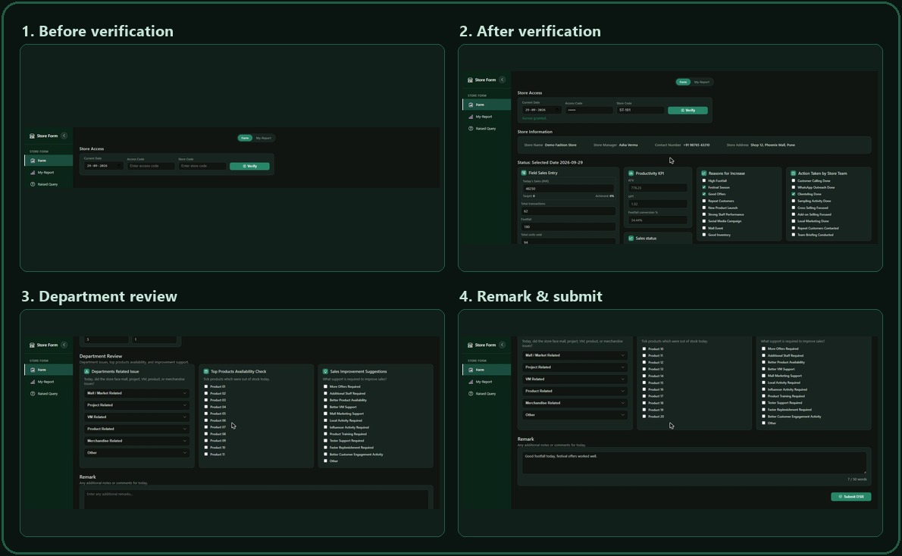
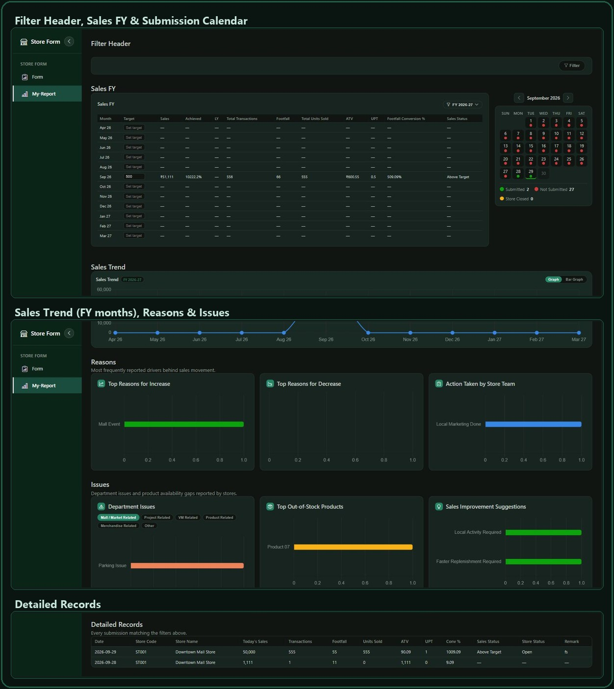

# Daily Sales Reports Collect (DSR)

A store-level Daily Sales Report (DSR) system. Store staff verify access with a
site code and access code, then submit a daily report covering sales,
staffing, targets, department issues, out-of-stock products, and remarks.
Submitted data can be reviewed on a reporting dashboard with KPIs, charts, and
a submission calendar.

## Screenshots

The Form page walk-through: before access verification, right after
verification (DSR entry workspace), the department review section, and the
remark / submit step:



The My-Report page: filter header, Sales FY targets/achievement with the
submission calendar, the FY sales trend chart, reasons/issues analytics, and
the detailed records table:



> Note: the data shown in these screenshots (store name, manager, sales
> figures, etc.) is sample/demo data used for illustration only.

## Tech stack

- **Backend:** Java 17, Spring Boot 3.3 (Web, Data JPA, Validation)
- **Database:** MySQL
- **Frontend:** Static HTML/CSS/JS served from Spring Boot (`backend/src/main/resources/static`), Bootstrap Icons, Chart.js

## Project structure

```
backend/
  src/main/java/com/dsr/backend/
    controller/   # REST controllers (site access, DSR form)
    dto/          # Request payloads
    entity/       # JPA entities (SiteMaster, DsrFormLog)
    repository/   # Spring Data repositories
    service/      # Business logic
  src/main/resources/
    application.properties
    static/       # index.html, app.js, styles.css (frontend)
```

## Prerequisites

- Java 17+
- Maven (or use the included `mvnw` wrapper if present)
- MySQL Server running locally

## Setup

1. Create a MySQL database (or let it auto-create — see below) and update
   `backend/src/main/resources/application.properties` with your own
   credentials:

   ```properties
   spring.datasource.url=jdbc:mysql://localhost:3306/dsr_db?createDatabaseIfNotExist=true&useSSL=false&serverTimezone=UTC
   spring.datasource.username=<your-mysql-username>
   spring.datasource.password=<your-mysql-password>
   ```

   The schema is managed automatically via `spring.jpa.hibernate.ddl-auto=update`.

2. Build and run the backend:

   ```bash
   cd backend
   mvn spring-boot:run
   ```

3. Open the app in your browser:

   ```
   http://localhost:8080
   ```

## Using the app

1. On the **Form** page, enter the current date, an **Access Code**, and a
   **Store Code**, then click **Verify** to unlock the store's DSR workspace.
2. Fill in today's sales, transactions, footfall, units sold, staffing
   counts, sales/store status, department issues, out-of-stock products, and
   any remarks, then submit.
3. Switch to **My-Report** to view aggregated KPIs, a submission calendar,
   sales trend charts, and a detailed records table for the verified store.

## API overview

| Method | Endpoint                    | Description                                    |
|--------|------------------------------|-------------------------------------------------|
| POST   | `/api/site-access`          | Verify a store/access code pair                |
| POST   | `/api/dsr-form`              | Submit a daily sales report                    |
| GET    | `/api/dsr-form`              | List all submitted DSR records                 |
| GET    | `/api/dsr-form/{id}`         | Get a single DSR record by ID                  |
| POST   | `/api/target-master`         | Create/update a store's target for a month     |
| GET    | `/api/target-master`         | List targets (optionally `?siteCode=` filter)  |

## Notes

- `application.properties` currently contains local development database
  credentials — replace them with your own before deploying, and avoid
  committing real production secrets.

## Process to use the project

1. **Onboard a store.** Add a row for the store in the `Site_master` table
   (siteCode, storeName, address, manager, and a unique `accessCode`). There's
   no admin UI for this yet — insert it directly via MySQL or a seed script.
2. **Start the backend.** Run `mvn spring-boot:run` from `backend/` (see
   [Setup](#setup)) and open `http://localhost:8080`.
3. **Verify store access.** On the **Form** page, the store staff enters the
   current date, the store's **Access Code**, and **Store Code**, then clicks
   **Verify**. This calls `POST /api/site-access` and unlocks the DSR
   workspace for that store.
4. **Submit the daily report.** Staff fill in today's sales, transactions,
   footfall, units sold, staffing counts, sales/store status, department
   issues, out-of-stock products, sales-improvement suggestions, and any
   remarks, then click **Submit DSR**. This is meant to be done once per store
   per day.
5. **Set monthly sales targets (optional).** On **My-Report → Sales FY**, click
   into any month's **Target** cell and enter a value — it saves immediately
   via `POST /api/target-master` and the **Achieved %** column updates against
   real submitted sales for that month.
6. **Review performance.** Switch to **My-Report** to see:
   - **Sales FY** — month-by-month target vs. actual sales, achievement %,
     last-year comparison, and other KPIs, alongside the submission calendar.
   - **Sales Trend** — FY month-wise sales chart.
   - **Reasons** — top reasons for sales increase/decrease and actions taken.
   - **Issues** — department issues (filterable by category), out-of-stock
     products, and sales-improvement suggestions.
   - **Detailed Records** — every submission for the store, filterable by
     date, month, or year via the **Filter Header**.
7. **Repeat daily.** Steps 3–4 repeat each day per store; step 6 is used
   ongoing by store managers/regional teams to track performance.
